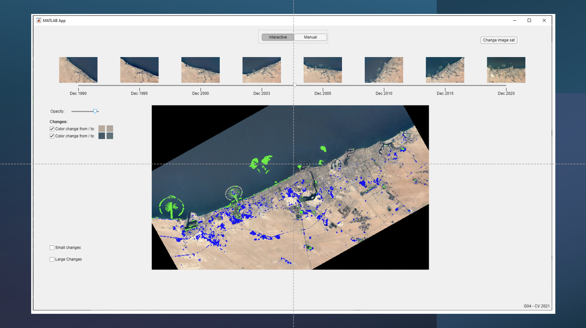

# Rotation and Scale Invariant Change Detection Application in Matlab

A MATLAB Program which detects and visualizes changes of satellite pictures.

## Requirements:

- Matlab (Version 2021a)
- Statistics and Machine Learning Toolbox
- Computer Vision Toolbox
- Image Processing Toolbox
- Signal Processing Toolbox

## Get Started

Application will be executed by running the file main.m on Matlab.
After running the main.m file the GUI window of the application will be opened. 
Another popup window will be shown, where either an image folder can be selected or the application can be quit.

### Preview

### Interactive mode:

The Interactive mode is activated by default.
After selecting an image folder, all images inside the folder will be shown on a timeline, sorted by time.
The timeline is partioned in several intervals. Inside one interval only the two adjacent images will be compared.
The application starts with comparing the first two images on the timeline by default. By dragging the slider inside one interval the second images will be placed over the first image, so that the two images can be compared to each other.
Two show the detected changes between the images, the 'Opacity' slider can be used. Using the slider the opacity of the change map can be changed.
The 'Changes' checkboxes allow the user to show specific land changes.
The checkboxes 'Small Changes' and 'Large Changes' allows the user to only display small and big change clusters.
Two compare the next two adjacent images on the timeline, the timeline slider can be dragged to the next intervall. By pressing the button 'Analyze this interval' the change detection starts.

### Manual mode:

If the user want to compare two specific images that are not adjacent, the user can switch to the Manual mode.
Using the checkboxes the user can select the two images that should be compared. By pressing on the button 'Compare selected image' the change detection starts.
Since the timeline is not available anymore in the manual mode, a slider at the bottom will be activated, which allows the user to place the second image over the first image.

To choose a new image set, a button on the top right 'Change image set' is available.

Already images that were already compared, are saved in the workspace. Change detection for these images doesn't need to be repeated.

